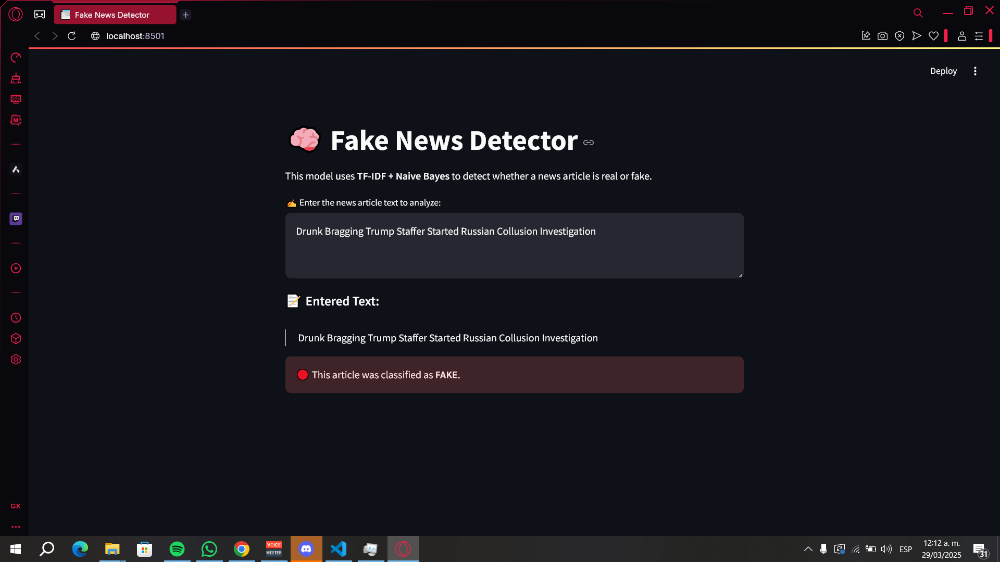

# 🧠 Fake News Detector  
### Detecting Misinformation with Machine Learning + Streamlit  

---

## 📌 Overview

**Fake News Detector** is a web application that allows users to paste a news headline or article and instantly determine whether it's **real** or **fake**.

This project uses **TF-IDF** vectorization and a **Multinomial Naive Bayes** model trained on real and fake news datasets. Built with **Streamlit**, it provides a clean and interactive interface, making machine learning practical and easy to use.

---

## 🧠 Key Features

- 🔍 Real-time classification of news text
- 🧹 Text preprocessing with stopword and punctuation removal
- 📐 TF-IDF vectorization
- 🤖 Multinomial Naive Bayes classification
- 💾 Model persistence using `joblib`
- 🌐 Intuitive UI with Streamlit

---

## 🖼️ Demo Screenshot

---

## 🛠️ Tech Stack

| Component        | Technology            |
|------------------|------------------------|
| Programming      | Python 3.9+            |
| ML Model         | Naive Bayes (Multinomial) |
| Feature Extraction | TF-IDF (Scikit-learn) |
| Text Processing  | NLTK                   |
| Interface        | Streamlit              |
| Visualization    | Matplotlib, Seaborn    |

---

## 📁 Project Structure

Modelonoticias/
│
├── data/                    # Raw datasets
│   ├── Fake.csv
│   └── True.csv
│
├── assets/                  # Screenshots or media
│   └── screenshot.png
│
├── src/                     # Source code
│   ├── cargar_datos.py         # Load and merge datasets
│   ├── eda.py                  # Exploratory Data Analysis
│   ├── modelo.py              # Model training and prediction
│   ├── preprocesamiento.py    # Text cleaning and preprocessing
│   └── app.py                 # Streamlit UI app
│
├── main.py                # Train + evaluate model from CLI
├── modelo.joblib          # Saved Naive Bayes model
├── vectorizer.joblib      # Saved TF-IDF vectorizer
├── requirements.txt
└── README.md

